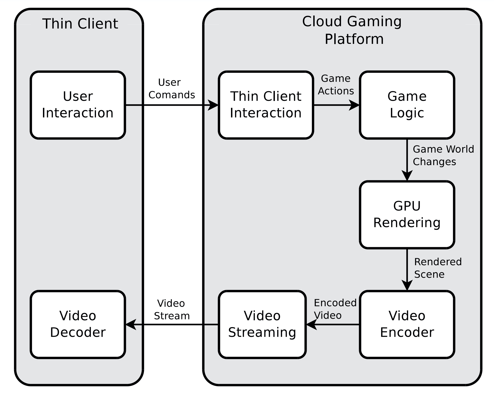
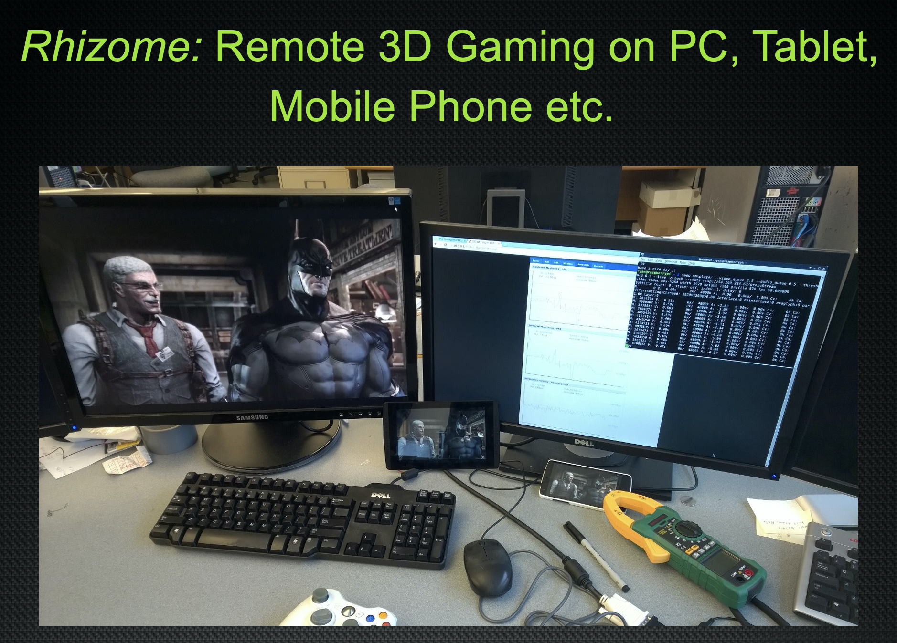

# Rhizome

Rhizome is a modular cloud gaming platform designed for public cloud. The server-side streaming engine is built on NVDIA GRID GPU (EC2 G2 instance) and supports both hardware and software based video encoding with H.264 codec. Rhizome integrates USP-over-IP protocol to cast user inputs and supports almost any (thin-)client devices. To accomplish ultra-low latency and a low power consumption gaming experience on the client device, Rhizome further optimizes the thin-client configuration and its interaction modules. 

For more technical details of Rhizome, please check our papers:

* _Cloud Gaming: Understanding the Support From Advanced Virtualization and Hardware, R Shea, D Fu, J Liu, IEEE Transactions on Circuits and Systems for Video Technology, Dec. 2015_ [[PDF]](http://ieeexplore.ieee.org/document/7137668/)
* _Towards bridging online game playing and live broadcasting: design and optimization, R Shea, D Fu, J Liu, ACM NOSSDAV, 2015_ [[PDF]](http://dl.acm.org/citation.cfm?id=2736089)
* _Rhizome: utilizing the public cloud to provide 3D gaming infrastructure, R Shea, D Fu, J Liu, ACM MMSys, 2015_ [[PDF]](https://dl.acm.org/doi/abs/10.1145/2713168.2713190)
* _Cloud gaming: architecture and performance, R Shea, J Liu, ECH Ngai, Y Cui - IEEE Network, 2013_ [[PDF]](https://dl.acm.org/doi/abs/10.1145/2713168.2713190)

Authors: **Dr. Ryan Shea**, Silvery Fu (committer), and Dr. Jiangchuan Liu.

----

In memory of Ryan.